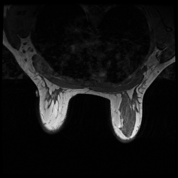
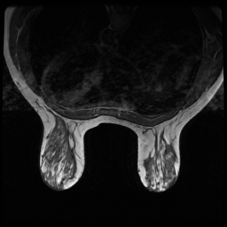

# Data Augmentation via Segmentation-Guided Diffusion Models

This repository provides the complete pipeline to train and evaluate a **Segmentation Guided Diffusion Model** on Breast MRI scans, using semantic masks to guide generation.

---

## 📁 Dataset

We use the **Duke-Breast-Cancer-MRI** dataset.

📥 **Download from:**  
[https://www.cancerimagingarchive.net/collection/duke-breast-cancer-mri]

🗂 **Folder structure:**

**Data Folder**

DATA_FOLDER
├── train
│   ├── tr_1.png
│   ├── tr_2.png
│   └── ...
├── val
│   ├── val_1.png
│   ├── val_2.png
│   └── ...
└── test
    ├── ts_1.png
    ├── ts_2.png
    └── ...

**Mask Folder**

MASK_FOLDER
├── all
│   ├── train
│   │   ├── tr_1.png
│   │   ├── tr_2.png
│   │   └── ...
│   ├── val
│   │   ├── val_1.png
│   │   ├── val_2.png
│   │   └── ...
│   └── test
│       ├── ts_1.png
│       ├── ts_2.png
│       └── ...

## Requirements

Install the required dependencies:

`pip install -r requirements.txt`

Ensure you have PyTorch installed with CUDA for faster training. 

## Training

Run the following command to train the model:
`CUDA_VISIBLE_DEVICES={DEVICES} python train.py \
  --img_dir data/breast_mri/images \
  --seg_dir data/breast_mri/masks \
  --segmentation_guided \
  --num_segmentation_classes 7 \
  --num_epochs 200 \
  --train_batch_size 5`

## Testing
`CUDA_VISIBLE_DEVICES={DEVICES} python3 main.py \
    --mode eval_many \
    --model_type DDIM \
    --img_size 256 \
    --num_img_channels {NUM_IMAGE_CHANNELS} \
    --dataset {DATASET_NAME} \
    --eval_batch_size 8 \
    --eval_sample_size 100`

## Results

The Segmentation-Guided Diffusion model was trained on a medical imaging dataset consisting of 11,860 images. The model was trained for 200 epochs with a reduced learning rate of `5e-5` and `750` diffusion timesteps.

The best results were achieved with the following settings:
- **Learning Rate**: `2e-5`
- **Batch Size**: `5`
- **Timesteps**: `750`
- **Epochs**: `200`

### Quantitative Results
| Metric       | Score     |
|--------------|-----------|
| Dice Score   | **0.9478** |
| FID Score    | **1.39**   |

### Qualitative Results
Below are examples of generated MRI images compared to their ground truth:

| Ground Truth (Real)       | Generated Output (Ours)     |
|---------------------------|-----------------------------|
|  |  |
|  |  |

> Ground truth images are from `../data/breast_mri/images/test/`  
> Generated outputs are saved in `ddpm-breast_mri-256-segguided/samples_test/`

